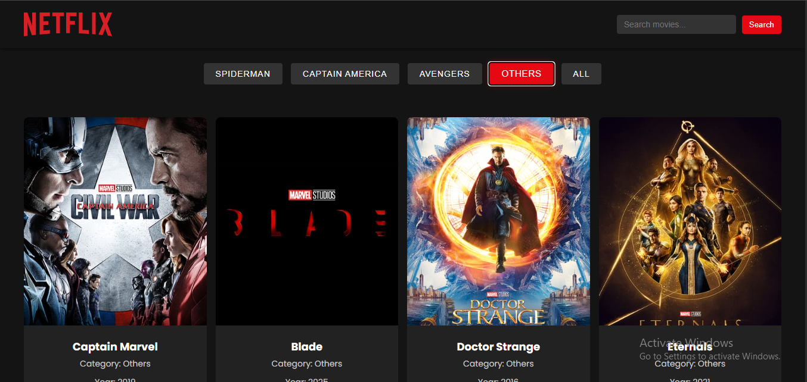

<div align="center">

<sub>Dev-Chandan404 / Netflix-Homepage</sub>

# 🎬 Netflix Homepage — Streaming UI Clone 🎬

### *Dark Theme. Movie Browsing. Binge-Worthy Design.*

<br/>

[](https://dev-chandan404.github.io/Netflix-Homepage/)
[](https://github.com/Dev-Chandan404/Netflix-Homepage)
[](https://github.com/Dev-Chandan404/Netflix-Homepage/issues)

<br/>

[](https://developer.mozilla.org/en-US/docs/Web/HTML)
[](https://developer.mozilla.org/en-US/docs/Web/CSS)
[](https://developer.mozilla.org/en-US/docs/Web/JavaScript)
[](https://pages.github.com/)
[](LICENSE)

<br/>

[](https://github.com/Dev-Chandan404/Netflix-Homepage/commits)
[](https://github.com/Dev-Chandan404/Netflix-Homepage)
[](https://github.com/Dev-Chandan404/Netflix-Homepage/stargazers)

<br/>

<a href="https://dev-chandan404.github.io/Netflix-Homepage/">

</a>

*A Netflix-style movie browsing UI — dark theme, category filters, search & interactive cards*

</div>

---

## ✨ About the Project

> A **Netflix-style movie browsing homepage** built with HTML, CSS, and JavaScript. This project replicates the iconic streaming platform UI — from the cinematic dark-themed hero banner to scrollable content rows, category filters, a live search bar, and interactive hover-effect movie cards.

This project is the ultimate test of **dark UI design**, **responsive layout techniques**, and **real-world streaming interface patterns** — all without a single framework.

---

## 🎯 Key Features

| | Feature | Description |
|---|---|---|
| 🎬 | **Netflix-Style Hero** | Cinematic full-width banner with backdrop overlay and CTA buttons |
| 🔍 | **Search Functionality** | Live search bar to filter through movie titles |
| 🏷️ | **Category Filters** | Browse movies by genre — just like the real thing |
| 🃏 | **Interactive Movie Cards** | Hover effects revealing movie details and actions |
| 🌑 | **Dark Theme Interface** | Authentic Netflix dark UI with red accent colour system |
| 📱 | **Fully Responsive** | Seamless experience across desktop, tablet, and mobile |

---

## 🛠️ Built With

<div align="center">

| HTML5 | CSS3 | JavaScript |
|-------|------|------------|
|  |  |  |

</div>

---

## 📂 Website Sections

| Section | Description |
|---------|-------------|
| 🧭 **Navbar** | Netflix-style top nav with logo, links, and search icon |
| 🎬 **Hero Banner** | Full-screen cinematic feature with title, description & CTAs |
| 🏷️ **Category Filters** | Genre tabs to sort and browse by movie category |
| 🎞️ **Content Rows** | Horizontally scrollable rows of poster-style movie cards |
| 🃏 **Movie Cards** | Interactive cards with hover reveal — rating, genre, actions |
| 📬 **Footer** | Links, language selector, and platform info |

---

## 🚀 Getting Started

No installation. No build step. Just clone and open.

```bash
# Clone the repo
git clone https://github.com/Dev-Chandan404/Netflix-Homepage.git
cd Netflix-Homepage

# Open directly in your browser
open index.html

# Or serve locally
npx serve .
# → http://localhost:3000
```

---

## 📁 Project Structure

```
Netflix-Homepage/
├── 📂 images/          # Movie posters, banners & thumbnails
├── index.html          # Full page — structure, styles & scripts
└── README.md
```

---

## 🔭 Roadmap & Possible Extensions

- [ ] Connect to TMDB API for real movie data
- [ ] Add JavaScript-powered content row sliders
- [ ] Implement video preview on card hover
- [ ] Build a login / signup UI flow
- [ ] Add a watchlist with localStorage persistence
- [ ] Convert into a React + API full streaming clone

---

> ⚠️ **Disclaimer:** This is an educational UI clone built for learning and practice only. It is not affiliated with or endorsed by Netflix or any streaming platform.

---

<div align="center">

## 📄 License

Distributed under the **MIT License**. See `LICENSE` for more information.

<br/>

✨ **Let's Connect** ✨

[](mailto:dev.chandankumar404@gmail.com)
[](https://github.com/Dev-Chandan404)
[](https://chandan404.netlify.app/)

<br/>

⭐ **If you like this project, please give it a star!** ⭐

*Made with ❤️ by **Chandan Kumar***

</div>
